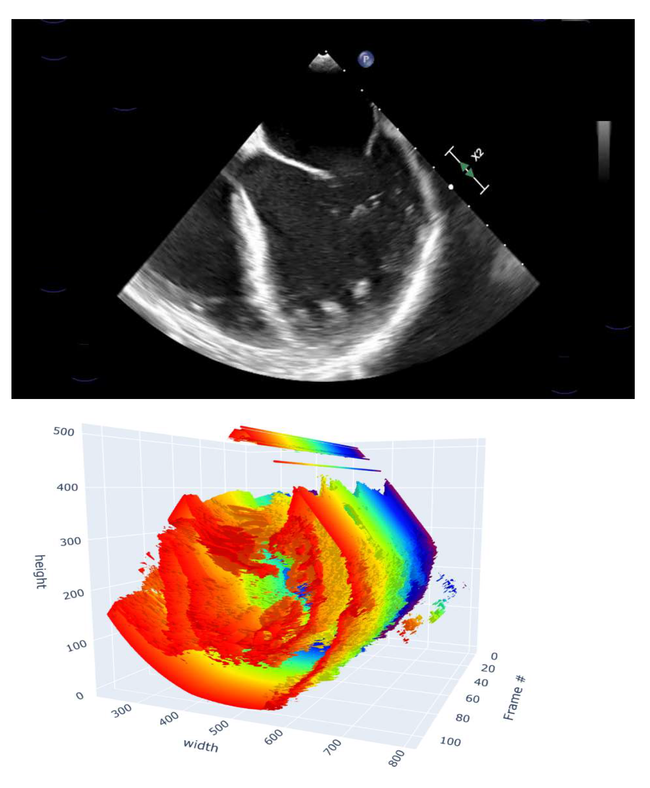
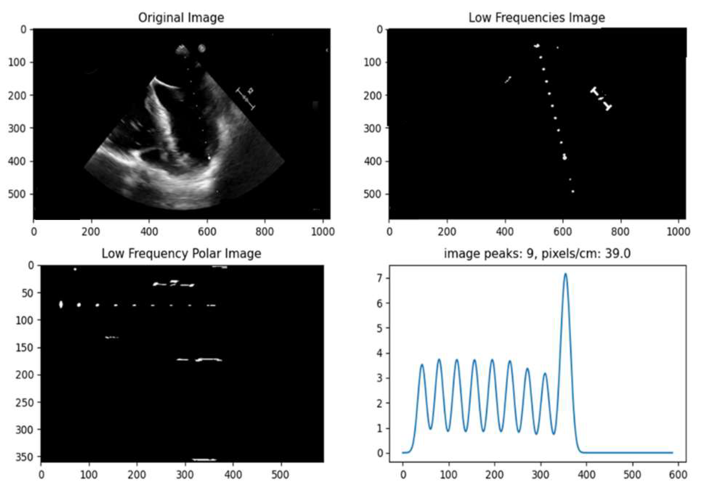
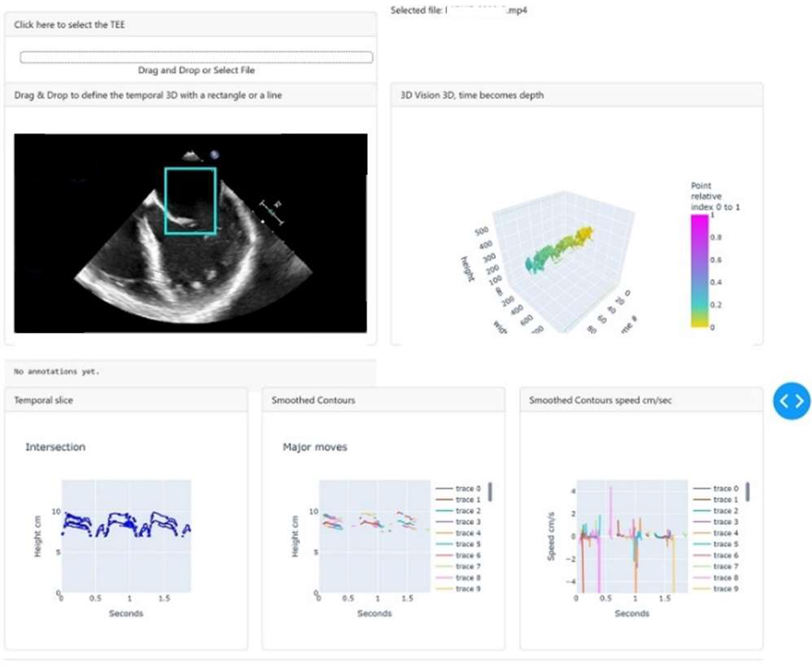
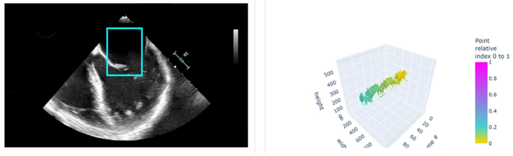
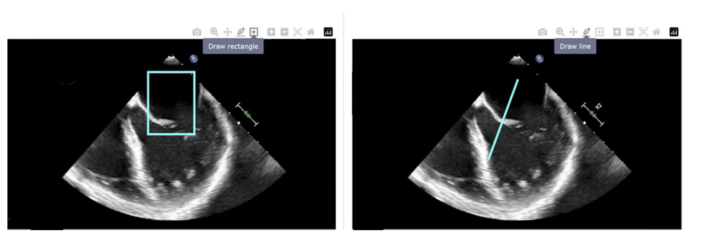
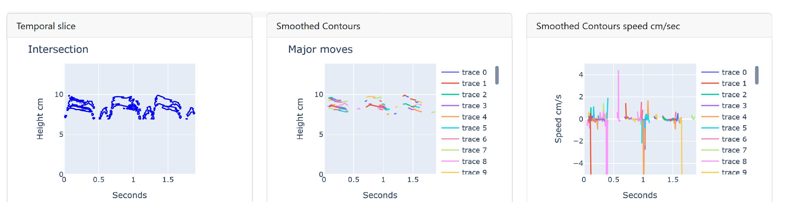
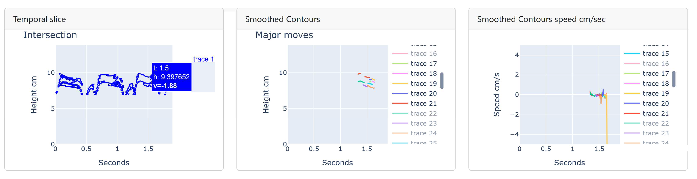

# TEE Time-Section Visualizer

A lightweight, single-file **Dash** application for visualizing time sections of Transesophageal Echocardiography (TEE) video clips, based on the method described in *"A simple tool for Visualizing Time Sections of Transesophageal Echocardiography with Python"* (Fiammante et al.).

The tool reconstructs a 3D "optical flow" volume from a TEE video — using video frames stacked in time as the third dimension — and lets a clinician interactively select a region (rectangle or line) to obtain a time/height slice showing boundary motion and speed (cm/s) of valve and vegetation contours. Scale (pixels/cm) is recovered automatically from the on-screen ultrasound scale marks using a 2D FFT, and frame timing (fps) is read from the video's own metadata, so no external calibration file is needed.

Everything runs **locally**: Dash starts a lightweight web server bound to `127.0.0.1` only, so the video and all processing stay on the clinician's machine with no external network exposure.

---

## 1. How it works (summary)

1. **Video ingestion** – The uploaded video is decoded frame-by-frame (`imageio` + `pyav`), converted to grayscale, and masked to the ultrasound sector (a 90° pie-slice mask) to remove on-screen text/UI clutter.
2. **Scale recovery** – A 2D Fast Fourier Transform of the first frame isolates the regularly spaced scale dots/dashes on the ultrasound sector. A polar warp centered on the transducer origin plus a peak-finding pass on the resulting radial profile gives the pixel-per-centimeter scale. Frame rate (fps) is read from the container's metadata via `pymediainfo`.
3. **3D reconstruction** – The stack of grayscale frames (time as the 3rd axis) is fed to the **Marching Cubes** algorithm (`skimage.measure.marching_cubes`, iso-level 92) to build a 3D mesh where the depth axis is time. This is displayed as an interactive Plotly `Mesh3d` object.
4. **Slice selection** – The user draws a **rectangle** or **line** on the first video frame. This defines a plane (via its midline/normal) that is intersected with the 3D mesh (`trimesh`) to produce 2D polygons: horizontal axis = time, vertical axis = position along the selected segment.
5. **Speed computation** – The polygons are split into monotonic (non-self-crossing) segments, smoothed, and their point-to-point gradient is converted to a speed in cm/s using the recovered scale and fps.
6. **Display** – Three synchronized panes show: the raw time/height slice, the smoothed/segmented boundary traces, and the corresponding speed-vs-time curves, using matching trace numbering and colors across the two right-hand panes.



*The first video frame (top) and the corresponding 3D mesh reconstructed by Marching Cubes, where depth is time (bottom).*



*Scale recovery sequence: original frame, isolated low-frequency scale dots, polar-warped view centered on the transducer, and the resulting radial peak profile used to compute pixels/cm.*

---

## 2. Requirements

Python 3.9+ and the following packages:

```
dash
dash-bootstrap-components
imageio[pyav]
numpy
scikit-image
plotly
Pillow
pymediainfo
trimesh
scipy
```

Install with:

```bash
pip install dash dash-bootstrap-components "imageio[pyav]" numpy scikit-image plotly Pillow pymediainfo trimesh scipy
```

> `pymediainfo` requires the native **MediaInfo** library to be installed on the system (e.g. `apt install libmediainfo0v5` on Debian/Ubuntu, `brew install media-info` on macOS, or the MediaInfo DLL on Windows).

---

## 3. Running the application

```bash
python visualisation_TEE.py
```

On startup the script:
- creates a local `temp/` folder if missing,
- clears any leftover `*.pkl` session files from previous runs (these hold each browser session's in-memory state — frames, mesh, current figures — so the app can be stateless between Dash callbacks),
- launches the Dash dev server on `http://127.0.0.1:8050` (default Dash port).

Open that address in a web browser. The whole application lives on a single page.

---

## 4. Application layout

The page is organized top to bottom:

| Row | Left | Right |
|---|---|---|
| 1 | **Upload card** – drag & drop / file picker for the TEE video | Selected file name |
| 2 | **First-frame view** – draw a rectangle or line to define the region of interest | **3D view** – time-as-depth mesh (zoom/rotate with mouse) |
| 3 | **Temporal slice** (raw) | **Smoothed contours** (segmented traces) | **Speed curves** (cm/s, same trace numbering) |



*The complete single-page layout: upload card and file name (top), first-frame annotation view and 3D time-as-depth mesh (middle), and the three temporal/speed panes (bottom).*

---

## 5. Step-by-step usage guide

### 5.1 Select / load a TEE file

1. In the top-left card **"Click here to select the TEE"**, either:
   - drag and drop a video file onto the dashed drop-zone, or
   - click **"Select File"** and browse to the file.
2. Only **one file at a time** is accepted (`multiple=False`).
3. Supported inputs are video containers readable by `imageio`'s `pyav` plugin (e.g. **MP4, AVI**) exported from the ultrasound system.
4. Once uploaded, the app:
   - extracts every frame and converts it to grayscale, masked to the ultrasound sector,
   - reads the frame rate (fps) from the video metadata,
   - attempts automatic **scale recovery** (pixels/cm) from the scale dots via the 2D FFT method — if this fails, a default fallback scale (40 px/cm) is used and a note is shown,
   - builds the initial 3D mesh (time-as-depth) around the whole frame, displayed in the right-hand **3D view** panel,
   - displays the **first frame** in the left-hand annotation panel with a default rectangle already drawn near the center as a starting example,
   - the selected file name appears next to the upload card, and an internal session ID is created so your work-in-progress (frames, current mesh, figures) can be restored between interactions without resending the whole video to the server each time.



*Right after upload: the first frame with the default rectangle (left) and the corresponding time-as-depth 3D mesh restricted to that region (right).*

### 5.2 Create a rectangular (or line) annotation

1. In the **"Drag & Drop to define the temporal 3D with a rectangle or a line"** panel, use the Plotly mode-bar tools (top-right of that graph) to pick either:
   - the **rectangle** draw tool, or
   - the **line** draw tool (useful for oblique cuts across a valve, at any angle).
2. Click-drag directly on the first frame to draw your shape over the anatomical region of interest (e.g. a valve leaflet or a vegetation).



*Left: rectangle selection tool active. Right: line selection tool active, allowing cuts at any angle.*

3. Only the **most recent shape** is kept — drawing a new rectangle/line replaces the previous one.
4. On release, a callback:
   - builds a binary mask from your rectangle (or a thickened line for line selections),
   - applies that mask to every grayscale frame so only your region of interest contributes to the 3D reconstruction,
   - determines the mid-line **segment** of your selection (vertical if the rectangle is taller than wide, horizontal otherwise; the line's own axis if using the line tool),
   - re-computes the 3D mesh restricted to the masked frames,
   - intersects the mesh with the plane defined by that segment's normal, producing the time/height polygons,
   - re-renders all three bottom panes (temporal slice, smoothed contours, speed curves) and the 3D view.
5. The footer of the annotation panel echoes the current selection's pixel coordinates (top-left / bottom-right).

**Tips**
- A **tall, narrow rectangle** samples motion along the vertical axis (e.g. leaflet opening/closing).
- A **wide, short rectangle** samples motion along the horizontal axis.
- The **line tool** lets you cut at an arbitrary angle when the structure of interest isn't axis-aligned.



*The three bottom panes after a selection: raw temporal slice (left), smoothed boundary traces (middle), and their speed curves in cm/s (right), with matching trace numbering.*

### 5.3 Select / isolate speed traces

Once a selection has been analyzed, the middle and right panes show one colored trace per detected boundary segment, using **matching numbering and colors** between the two panes:

- **"Smoothed Contours"** (middle pane) — each trace is a simplified, monotonic segment of the boundary's time evolution, labeled in the legend.
- **"Smoothed Contours speed cm/sec"** (right pane) — the corresponding instantaneous speed (cm/s) for each of those same traces, plotted against time.

To focus on specific structures (e.g. isolate the vegetation from the valve leaflet):

- **Double-click** a trace's legend entry (in either the middle or right pane) to show **only that trace**, hiding all others.
- **Single-click** a legend entry to toggle that individual trace on/off while keeping others visible.
- Double-click again on the legend (or on an already-isolated trace) to restore all traces.
- Hovering over any point on a trace (in any of the three panes) shows a tooltip with **time (s)**, **height/position (cm)**, and the **local speed (cm/s)** at that point.

The left pane ("Temporal slice") shows the full, unsegmented raw slice for reference alongside the two trace-based panes.



*A single trace isolated (double-clicked) in the temporal slice pane, with its hover tooltip showing time, height, and speed; matching legend entries are dimmed in the other two panes.*

---

## 6. Code structure reference

| Function | Role |
|---|---|
| `get_mask` / `mask_image` | Build and apply the 90° pie-slice mask isolating the ultrasound sector |
| `process_video` | Decode the uploaded video into RGB and grayscale frame stacks; read fps via `pymediainfo` |
| `generate_mesh` | Run Marching Cubes on the frame stack and build the Plotly `Mesh3d` time-as-depth view |
| `getscale` | Recover the pixel/cm scale from the scale dots using a 2D FFT + polar warp + peak detection |
| `get_polygons` / `slice_with_inclined_plane` / `meshsection` | Intersect the 3D mesh with the plane defined by the user's rectangle/line and build the time/height polygons |
| `split_polygon_by_x_direction`, `get_x_signs_with_diff`, `remove_consecutive_duplicates` | Split raw slice polygons into monotonic, de-duplicated segments for clean speed traces |
| `frame_to_base64` | Encode a frame for inline browser display |
| `parse_path` | Parse Plotly's freehand SVG path syntax when a `path`-type shape is drawn |
| `thickline` | Rasterize a thick line mask for the line-selection mode |
| `update_output` (the `@app.callback`) | Master Dash callback wiring file upload and shape-drawing events to all figure/panel updates; persists per-session state to a `.pkl` file keyed by a UUID so results survive between callback invocations |

---

## 7. Notes and limitations

- Designed for **simplicity and speed**, not exhaustive accuracy: the scale-recovery and masking heuristics assume a fairly standard on-screen layout for the ultrasound sector and scale marks; unusual vendor overlays may require adjusting the pie-slice mask parameters or the FFT filter window in `getscale`.
- If automatic scale recovery fails, the app falls back to an approximate default (40 px/cm) and flags this in the annotation text — always verify measurements clinically before relying on them.
- The app keeps per-browser-session state in local pickle files (`<session-id>.pkl`) in the working directory; these are cleared automatically on each application restart.
- No video or patient data leaves the local machine — the Dash server binds only to `127.0.0.1`.

---

## 8. License

MIT License — Copyright (c) 2024 Marc Fiammante. See the header of `visualisation_TEE.py` for the full license text.
